# Change Data Capture (CDC) Sync Engine

Architectural overview of the CDC Sync Engine. This pipeline decouples the write-heavy relational database (PostgreSQL) from the read-heavy search index (Elasticsearch) using an event-driven CQRS pattern.

## 1. System Context

The CDC Sync Engine is responsible for:
- Tailing the PostgreSQL Write-Ahead Log (WAL) via Debezium.
- Serializing changes to JSON/Avro via Kafka.
- Consuming those changes safely via a deterministic Spring Kafka implementation with precise Dead-Letter Queue (DLQ) routing.
- Replicating the state into Elasticsearch for fast, full-text search.

## 2. CQRS & CDC Pattern

By implementing Command Query Responsibility Segregation (CQRS), we achieve independent scaling for reads and writes. The CDC pipeline ensures that our read model (Elasticsearch) is eventually consistent with our write model (PostgreSQL) without placing synchronous HTTP calls between them.

### Data Replication Flow

```mermaid
sequenceDiagram
    participant App (Write Model)
    participant PostgreSQL (WAL)
    participant Debezium (Kafka Connect)
    participant Kafka Topic
    participant Spring Kafka Consumer
    participant Elasticsearch (Read Model)

    App (Write Model)->>PostgreSQL (WAL): UPDATE orders SET status = 'SHIPPED'
    
    rect rgb(40, 40, 40)
        Note over PostgreSQL (WAL),Debezium (Kafka Connect): 1. Change Capture
        PostgreSQL (WAL)-->>Debezium (Kafka Connect): Log Sequence Number (LSN) Advancing
        Debezium (Kafka Connect)->>Debezium (Kafka Connect): Parse wal2json/pgoutput
    end
    
    rect rgb(40, 60, 40)
        Note over Debezium (Kafka Connect),Kafka Topic: 2. Serialization
        Debezium (Kafka Connect)->>Kafka Topic: Publish Payload (op='u')
    end

    rect rgb(60, 40, 40)
        Note over Kafka Topic,Elasticsearch (Read Model): 3. Sync & Indexing
        Kafka Topic-->>Spring Kafka Consumer: Poll Record
        Spring Kafka Consumer->>Elasticsearch (Read Model): Upsert Document
    end
```

## 3. Resilience and DLQ Strategy

If the Elasticsearch cluster goes down or rejects a document (e.g., mapping error), the Spring Kafka consumer utilizes `@RetryableTopic`.
1. **Backoff**: It retries transient exceptions (e.g., `SocketTimeoutException`) with an exponential backoff.
2. **Instant DLQ**: Deterministic exceptions (e.g., `JsonProcessingException`) completely bypass the retry mechanism and are routed to the DLQ instantly, preserving consumer bandwidth.

## 4. Key Technologies
- **Java 21 & Spring Boot 3.4.x**: Core framework.
- **Debezium**: Log-based Change Data Capture.
- **Apache Kafka**: Event streaming.
- **Elasticsearch 8**: Read-optimized inverted index.
- **Testcontainers**: Massive multi-threaded concurrency testing.

## 5. Architectural Decisions (ADRs)

### ADR-001: Why We Use Debezium Over Outbox Polling
**Context:** Historically, systems utilized `@Scheduled` cron jobs to poll an "Outbox" table to detect changes.
**Decision:** We exclusively use Debezium to tail the PostgreSQL Write-Ahead Log (WAL).
**Rationale:** Polling introduces severe CPU spiking, database lock contention, and artificial latency. Tailing the WAL is infrastructure-as-code and requires zero application-level database locks. It entirely eliminates the risk of missing events during "Dual-Write" failure modes where an application tries to write to a database and Kafka in the same transaction.

### ADR-002: Strict Deterministic DLQ Routing
**Context:** Standard Kafka consumers often retry indefinitely or fail entire batches on single-message mapping errors.
**Decision:** We enforce a single-record listener using Spring's `@RetryableTopic` with explicit transient/deterministic exception splitting.
**Rationale:** Blindly retrying a `JsonProcessingException` is counter-productive and wastes CPU cycles. Routing it to the DLQ instantly ensures the main partition remains unblocked (preventing poison pills) while retaining exponential backoffs for actual infrastructure blips.

### ADR-003: Deterministic Connection Management
**Context:** High-throughput async consumers and web threads often poison connection pools if `ThreadLocal` contexts aren't wiped.
**Decision:** We implement a mandatory `ConnectionLeakPreventionInterceptor`.
**Rationale:** By attaching a `HandlerInterceptor` and Hibernate `StatementInspector`, we ensure that all thread-bound states are wiped after execution, making memory leaks structurally improbable.
