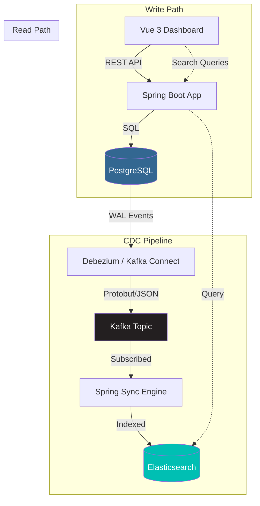

# CDC Sync Engine

This project demonstrates how to sync data incrementally from a PostgreSQL database to an Elasticsearch search index. It uses Debezium to capture changes from the Postgres WAL and stream them through Kafka to a Spring Boot consumer.

This setup avoids the need for dual-writes in the application. Instead, it relies on the database's write-ahead log to keep the search index updated automatically.

---

## System Architecture

The pipeline uses Debezium to stream mutations from the Postgres WAL into a Kafka topic. A Spring Boot service then processes these events to maintain a replica in Elasticsearch.



### Why this approach?

* **Decoupled writes**: The main application logic doesn't need to know about Elasticsearch.
* **Reliability**: Events are buffered in Kafka. If the sync service goes down, it will resume where it left off.
* **Consistency**: Only committed transactions are synced to Elasticsearch.

---

## Quick Start

### 1. Prerequisites

* Docker Desktop
* Java 21
* Node.js 18+

### 2. Build and Infrastructure

First, build the Java project and start the containers:

```bash
# Build the project
./mvnw clean install

# Start Postgres, Kafka, Elasticsearch, and the app
cd docker
docker compose up -d --build
```

### 3. Verify Connector Registration

The setup includes a container that automatically registers the Debezium connector. You can check if it's running with this command:

```bash
curl http://localhost:8083/connectors
# Expected: ["orders-connector"]
```

> [!TIP]
> If the list is empty, you can manually register it:
>
> ```bash
> curl -X POST http://localhost:8083/connectors -H "Content-Type: application/json" -d @docker/connector-config.json
> ```

### 4. Run the Dashboard

The project includes a Vue 3 dashboard to see the synchronization in action:

```bash
cd ui
npm install
npm run dev
```

URL: [http://localhost:5173/](http://localhost:5173/)

---

## Technical Details

### Type Mapping

To keep types consistent between Postgres and Elasticsearch, Debezium is configured as follows:

* **decimal.handling.mode=string**: This prevents precision loss for decimal types.
* **time.precision.mode=connect**: This standardizes timestamps to epoch milliseconds.

### Event Handling

The sync service in `CdcEventConsumer.java` handles different types of operations:

1. **Deletes**: It uses the 'before' state to find the ID and remove the document from Elasticsearch.
2. **Creates/Updates**: It maps the 'after' state directly to the Elasticsearch index.
3. **Ghost events**: It ignores tombstone events that don't contain data.

---

## Common Issues

| Symptom | Resolution |
| :--- | :--- |
| Backend Unreachable | Check if port 8080 is already in use. Run `docker compose ps` to see if the app container is running. |
| Data not syncing | Check the connector status: `curl http://localhost:8083/connectors/orders-connector/status`. |
| Connection Timeout | Make sure Docker has enough memory (at least 4GB) as Kafka and Elasticsearch are heavy. |

---

## Running Tests

The project uses Testcontainers for integration testing. This spins up temporary Postgres and Kafka instances during the build:

```bash
./mvnw test
```

---

*This project is a demonstration of event-driven synchronization between primary and secondary data stores.*
